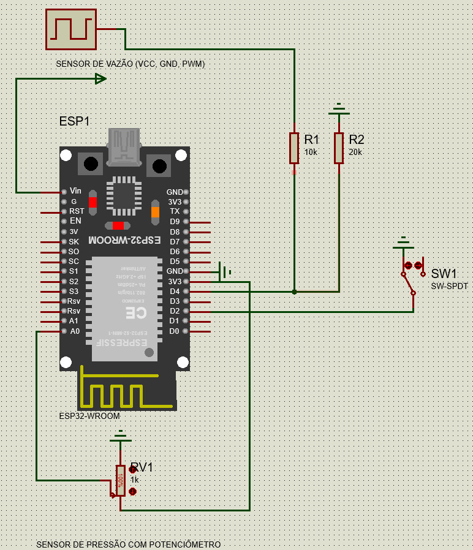

# Smart Water: Democratizando a Gestão Hídrica

A **Smart Water** é uma startup focada em revolucionar o monitoramento de recursos hídricos, democratizando o acesso à tecnologia de detecção de vazamentos. Este repositório documenta a nossa implementação de hardware: um "Nó de Borda" (*Edge Node*) de baixo custo e alta eficiência, projetado para residências e pequenos comércios.

## O Problema

A gestão hídrica atual sofre com três grandes dores:
1. **Invisibilidade do consumo**: O usuário só descobre o desperdício quando a conta de água chega.
2. **Vazamentos silenciosos**: Canos estourados ou vazamentos ocultos podem desperdiçar água por dias ou semanas.
3. **Barreira Tecnológica**: As soluções de mercado focam no nível estritamente industrial (protocolos HART, Profibus, etc.), com custos de implementação proibitivos (de R$ 5.000 a R$ 15.000 por ponto), tornando a adoção inviável para o cidadão comum ou para redes descentralizadas.

## A Nossa Solução: Inteligência na Borda

Para preencher o abismo entre o equipamento industrial inacessível e a falta de monitoramento residencial, desenvolvemos um hardware baseado em microcontrolador ESP32 que custa **menos de R$ 200,00**. A escolha do ESP32 é estratégica: ele possui **conectividade Wi-Fi nativa**, o que permite o envio contínuo dos dados de telemetria diretamente para o nosso backend na nuvem sem necessidade de módulos extras.

Em vez de atuar como um leitor passivo que apenas envia sinais elétricos brutos, nossa placa processa os dados localmente, embarcando as leis da física no próprio chip. 

### Lógica e Cálculos Embarcados

O cérebro do projeto utiliza rotinas matemáticas (já implementadas e validadas no nosso firmware em `esp32/Esp32.ino`) para inferir o estado da rede hídrica:

* **Nível de Água e Pressão**: O firmware converte a leitura do ADC (Analógico-Digital) referente ao transdutor físico de 1.2MPa para calcular a pressão em tempo real, fundamentado no **Teorema de Stevin**:
  `P(absoluta) = P(atmosférica) + ρ · g · h`
* **Vazão**: Através de interrupções de hardware (`attachInterrupt`), o ESP32 capta precisamente os pulsos magnéticos do sensor YF-S201 (onde Frequência = 7.5 * Vazão em L/min) e aplica a **Equação da Continuidade**:
  `Q = v · A`

Com base nesses dados, o algoritmo autônomo identifica padrões anômalos:
- **Cano estourado**: Detectado por uma queda abrupta de pressão simultânea a um aumento brusco de vazão.
- **Vazamento oculto**: Identificado, por exemplo, por um fluxo de água contínuo e ininterrupto durante a madrugada.

Esses dados são empacotados em formato JSON e transmitidos para o nosso aplicativo e interface web, alertando o cliente e resolvendo o problema direto na fonte.

## Lista de Materiais (BOM)

Abaixo estão os componentes principais utilizados na montagem do nosso hardware. O foco é manter o baixo custo e utilizar sensores que se adaptem perfeitamente ao padrão brasileiro de tubulações.

| Componente | Preço Estimado | Link para Compra |
| :--- | :--- | :--- |
| **Microcontrolador ESP32** | R$ 43,00 | [Mercado Livre](https://www.mercadolivre.com.br/p/MLB28251016?pdp_filters=item_id:MLB3786730067&matt_tool=38524122#origin=share&sid=share&wid=MLB3786730067&action=whatsapp) |
| **Transdutor de Pressão (1.2MPa)** | R$ 59,30 | [Mercado Livre](https://www.mercadolivre.com.br/p/MLB2001857306?pdp_filters=item_id:MLB3907337411&matt_tool=38524122#origin=share&sid=share&wid=MLB3907337411&action=whatsapp) |
| **Sensor de Vazão YF-S201** | R$ 37,20 | [Mercado Livre](https://www.mercadolivre.com.br/up/MLBU726456741?pdp_filters=item_id:MLB1021474572&matt_tool=38524122#origin=share&sid=share&wid=MLB1021474572&action=whatsapp) |

## Arquitetura e Engenharia Eletrônica

Um dos grandes diferenciais técnicos da nossa montagem é a forma como lidamos com a diferença de tensão entre os componentes.

O transdutor de pressão opera com uma tensão de **5V**, enquanto o ESP32 suporta no máximo **3.3V** em seus pinos analógicos (qualquer valor acima disso pode queimar o processador). Para evitar o uso de conversores de nível lógico comerciais e caros, implementamos um **Divisor de Tensão Resistivo** simples diretamente na placa. Essa solução elegante de engenharia eletrônica garante a segurança do circuito e mantém o custo de fabricação extremamente baixo.

### Esquemático do Projeto

## Sustentabilidade e ESG

O projeto foi pensado desde o início para atender rigorosamente à agenda ESG (Ambiental, Social e Governança), focando na responsabilidade com o meio ambiente ao longo de todo o ciclo de vida.

1. **Eficiência Energética**: O código do ESP32 foi otimizado para operar em modo de hibernação (*Deep Sleep*). A placa acorda apenas nos intervalos necessários para realizar as medições, efetuar os cálculos matemáticos, empacotar os dados e transmitir, retornando imediatamente a dormir. Isso reduz drasticamente o consumo de energia.
2. **Logística Reversa (E-waste)**: Sabemos que a adoção de hardware gera lixo eletrônico. Por isso, nosso modelo de negócios prevê um programa de logística reversa. O cliente poderá devolver o equipamento obsoleto, e a Smart Water garante o descarte e a reciclagem adequados, evitando a contaminação do solo e do meio ambiente.

---

## Criadores

| Avatar | Nome |
| :---: | :--- |
|  | [Guilherme Augusto](https://github.com/gui200428) |
|  | [João Francisco B. Ferreira](https://github.com/jfscripts) |
|  | [Vitor Ronald Barbist](https://github.com/ronald-barbist) |
|  | [Luccas Henrique R. da Silva](https://github.com/LuccasHenrique13) |
|  | [Matheus Gonzalez](https://github.com/Mgonzalez980) |